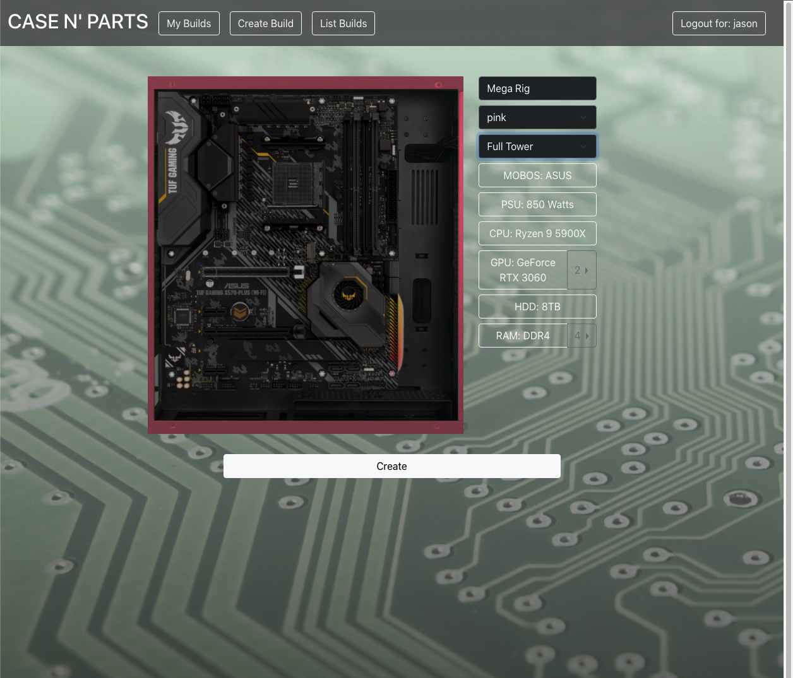

# Case N' Parts

This web application allows you to experiment with different parts and computer cases to build your desired PC.

## Technologies Used

- Setup and Configuration: \
  
  

- Front End Development : \
  
  

- Back End Development: \
  
  
  

- Deployment: \
  

## Setup

Install Docker

In your terminal, create docker volume: \
`docker volume create cnp-data`

Docker compose build and then up: \
`docker compose build`
`docker compose up`

Access in browser:\
`http://localhost:3000`

---

## Contributors

- Chad
- Jason
- Jarett
- Jaylon

## Design

- [API design](docs/apis.md)
- [Data model](docs/data-model.md)
- [GHI](docs/ghi.md)
- [Integrations](docs/integrations.md)

## Intended market

The people we would expect to use this application, are pc hobbyists and enthusiasts.
People that care about how their PC looks, and not just how it works.

## Backend needs

- As we are unable to find an API to handle products, we created a web scraper to pull computer part details.

---

### Functionality

- Users should be able to sign up for an account so that they save their builds
- Users should be able to browse through a huge database of computer hardware
- Users should be able to add parts that they want to a build list
- Users should be able to save multiple different build lists
- Users should be able to CRUD their build lists
- A part that a user adds to a build list should show a warning if the part that was added is incompatible with another part.- Users should be able to CRUD their build lists
- From the build list, users should be able to click a shop button that opens up a 3rd party site, aka Newegg, where they can see the prices for those parts.
- There should be a topdown view of a computer case where users can drag on parts that snap to the correct locations so that users can see how they look.
- Users should be able to publish their private builds to be public.
- Ability for other users to comment on builds that are made public.
- Have a rating system for each public build.
- At the end of the month, automatically show the top rated build of the month.
  - If the top rated build is tied with another in rating, use the amount of views it has to break the tie.
    - If that does not break the tie, show both builds.

---

## App Overview

 
    <h3 align="center">Homepage with top builds and case designs</h3>
  
     
    <h3 align="center">Create your custom PC with detailed view of each part</h3>
    
      
    <h3 align="center">Detailed view of a build; public list of all user builds</h3>
    
     
  

