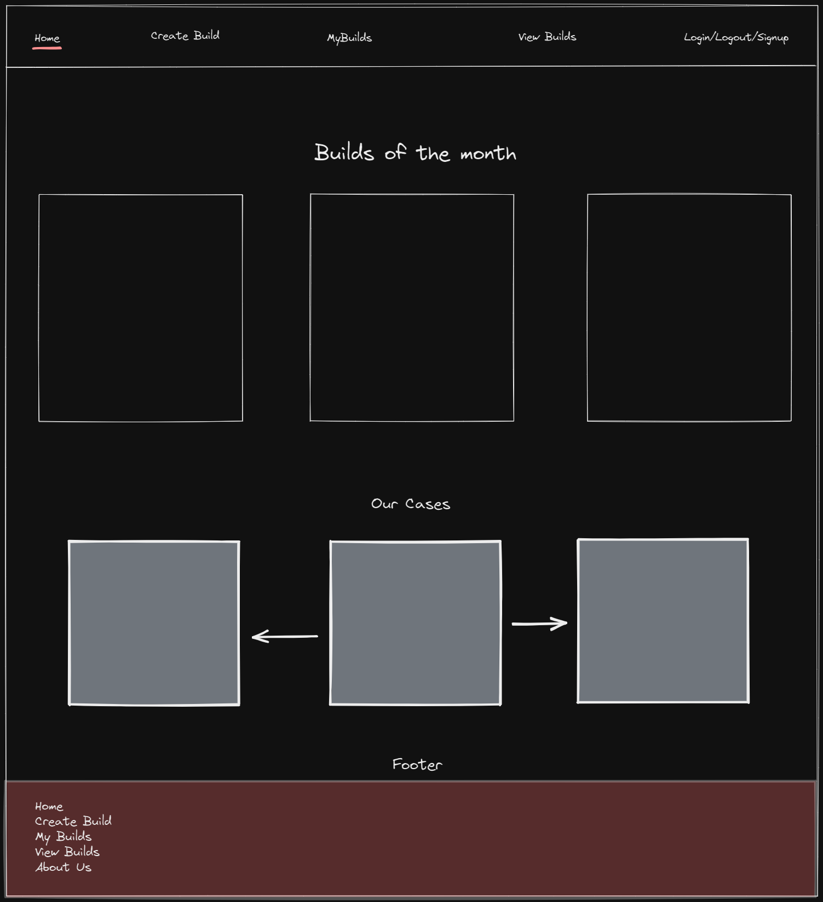
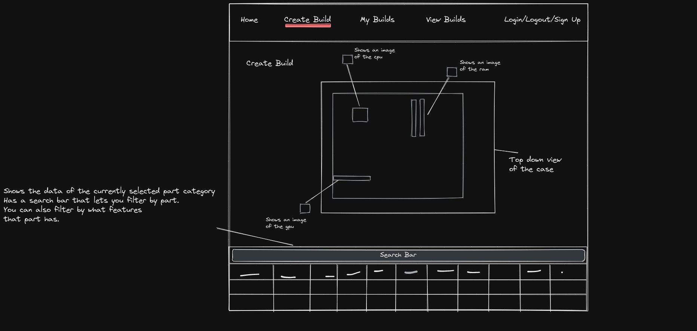
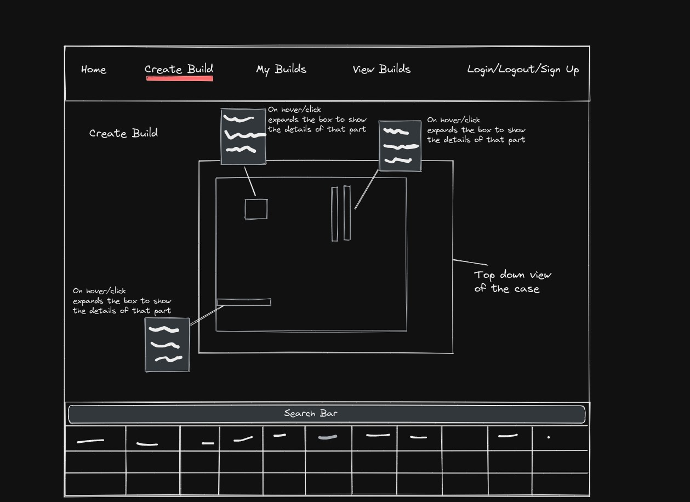
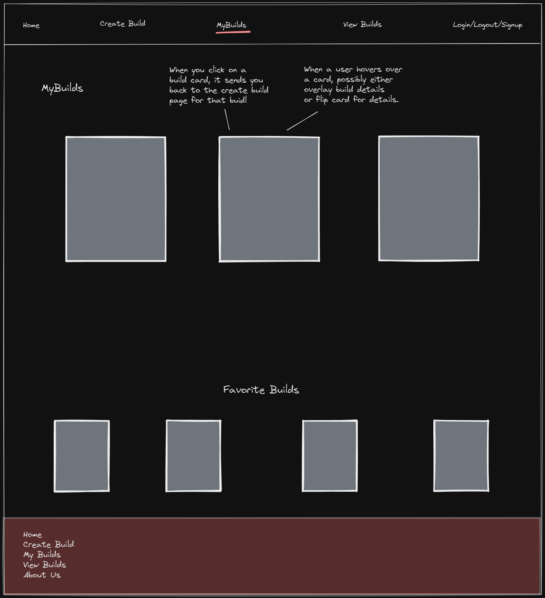
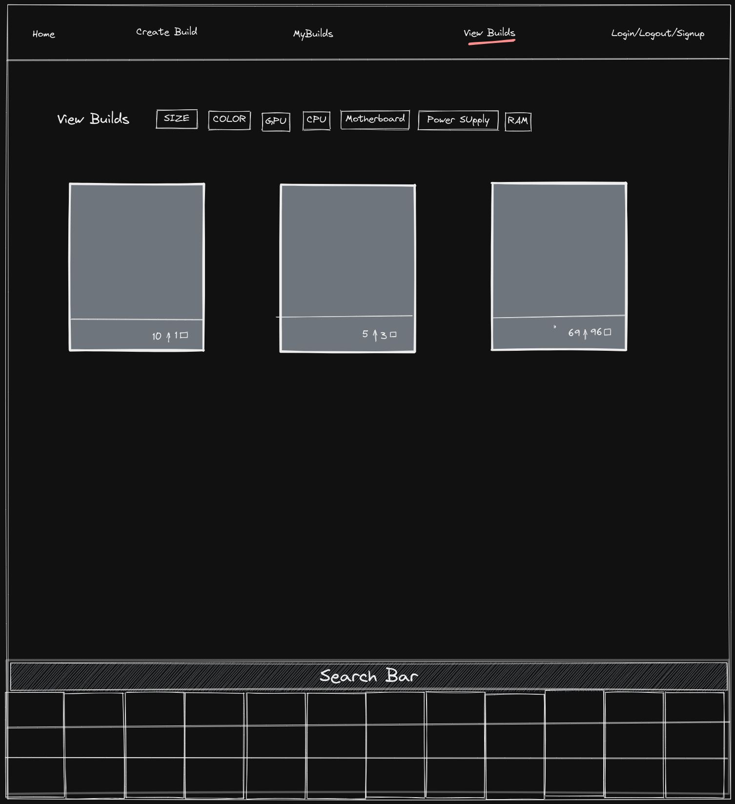
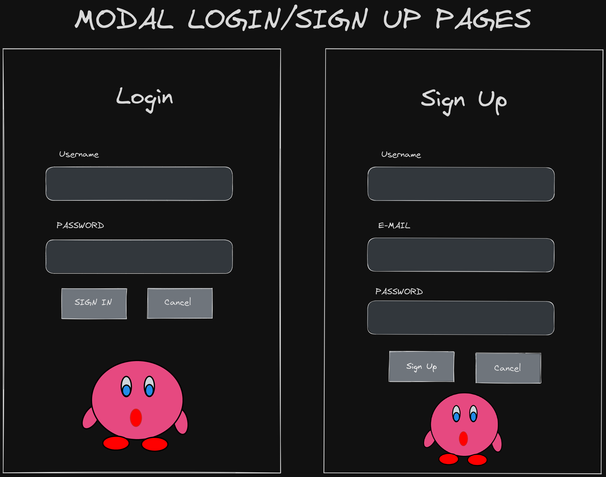

# Graphical Human Interface

## Home page

This is the main page that will be displayed when the site first loads

---

## Create Build page

This is the page that will be displayed when someone goes to create a new pc build

---

## My Builds page

This page will be displayed when a user goes to view the builds that they have already made.

---

## View Builds page

This page will be displayed when a user goes to the View Builds page. It will display
all of the builds that are public.

---

## Login modal

This will just be a modal component that appears when you click on the login
button.

